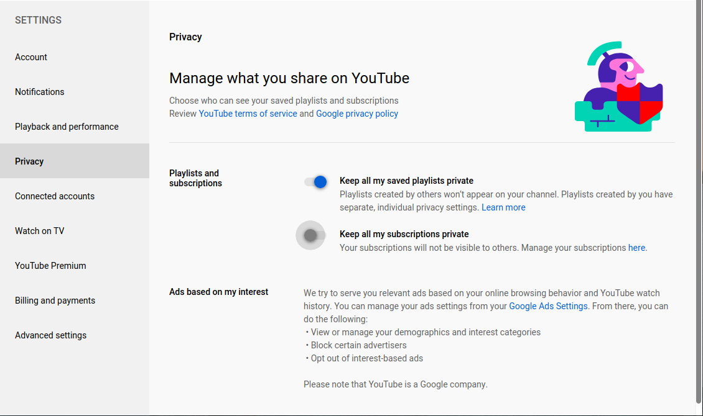

# Installing
Python packages required to connect to the Youtube API.

```
pip3 install --upgrade google-api-python-client google-auth-oauthlib google-auth-httplib2
```
Inside the project create folder named **config** and create a file in it named **youtube.ini**. It should be formatted like the following:
```
[youtube]
key = 
yourChannel = 
discordWebhooks = 
...
```
* key - is your Youtube API key
* yourChannel - is your channel ID you want to get the subs for 
* discordWebhooks - are the names and webhooks for the discord channels to post videos in

To get all your subs on youtube you need to make sure that your subs are not private by going to https://www.youtube.com/account_privacy


Run **youtubeSetup.py** to create the database and place the **youtube.db** file in the **config** folder. You will need to fill out the category for the corresponding discord webhook key.

Once this setup is complete run **youtube.py**

## Docker
```
docker build --no-cache--tag youtube-subs:1.0 .
docker run -v path to config:/config --detach --name youtube-sub youtube-subs:1.0
```

